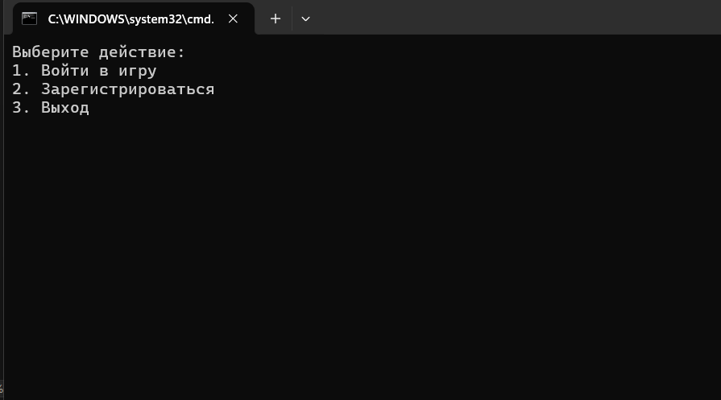

# Игра с числами

## Описание игры

"Игра с числами" — это консольное приложение, в котором игрок должен угадать 4-значное число, сгенерированное компьютером. Число состоит из уникальных цифр, и игроку предоставляется обратная связь по каждому вводу, чтобы помочь с отгадкой. Цель игры — угадать число за минимальное количество ходов.

### Правила игры:
1. Программа генерирует случайное 4-значное число, все цифры которого уникальны.
2. Игрок вводит 4-значное число, и программа проверяет его совпадение с загаданным числом.
3. После каждого ввода игроку сообщается, сколько цифр стоят на правильных местах и сколько всего угаданных цифр присутствует.
4. Игра заканчивается, когда игрок угадывает все 4 цифры на правильных местах.
5. Прогресс игрока сохраняется, и он может продолжить игру в следующий раз.

### Пример хода игры:
- Загаданное число: `1234`
- Ввод игрока: `1352`
- Ответ программы: `1 на месте, всего 3.`

## Описание генерации уникального числа

Метод `GenerateUniqueDigitNumber` используется для создания случайного 4-значного числа, где все цифры уникальны. Генерация происходит следующим образом:

1. Создается пустая строка `number`, которая будет содержать итоговое число.
2. Используется `Random` для генерации случайных чисел.
3. Пока длина строки `number` не станет равной 4, программа генерирует случайное число от 0 до 9.
4. Программа проверяет, содержит ли `number` сгенерированную цифру. Если нет, добавляет цифру к `number`.
5. Когда строка длиной 4 символа сформирована, она преобразуется в `int` и возвращается как сгенерированное число.

Пример работы функции:

```csharp
static int GenerateUniqueDigitNumber()
{
    Random rnd = new Random();
    string number = "";

    while (number.Length < 4)
    {
        int digit = rnd.Next(0, 10);
        if (!number.Contains(digit.ToString())) // Проверка на уникальность
        {
            number += digit;
        }
    }

    return int.Parse(number);
}
```
## Скриншот главного меню
